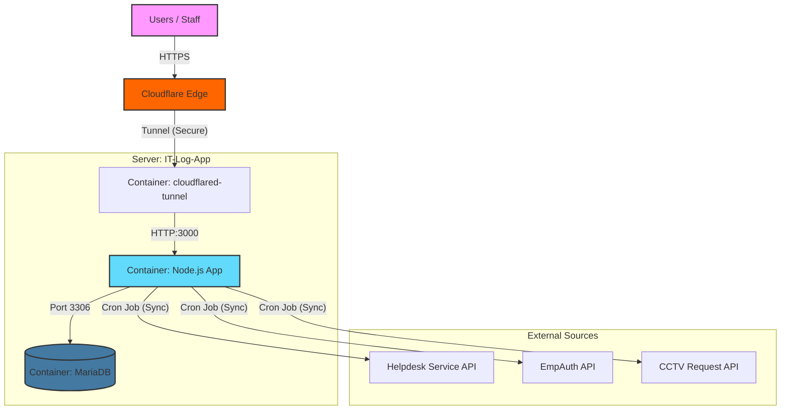
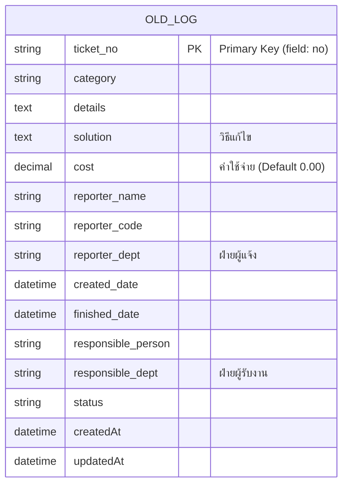
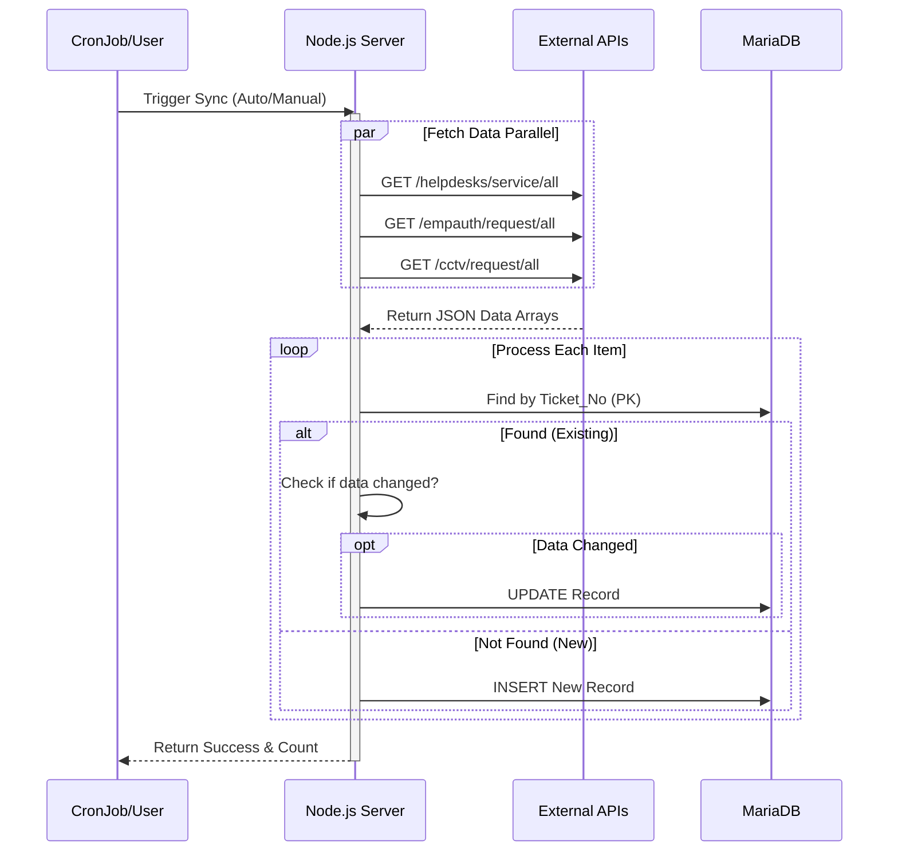

# 🖥️ IT Helpdesk Log System (Legacy Data Management)

ระบบจัดการข้อมูลย้อนหลังสำหรับฝ่าย IT รองรับการเก็บข้อมูล Helpdesk, Permission Request และ CCTV Request โดยซิงค์ข้อมูลจากระบบภายนอกผ่าน API และมีการจัดการสิทธิ์เข้าถึงผ่าน Google OAuth

## 🏗️ System Architecture (ภาพรวมระบบ)

## 🗃️ Database Schema

โครงสร้างตาราง `old_helpdesk_logs` สำหรับเก็บข้อมูลรวม

## 🔄 Sync Process Flow

ขั้นตอนการทำงานของระบบ Auto Sync (Cron Job)

